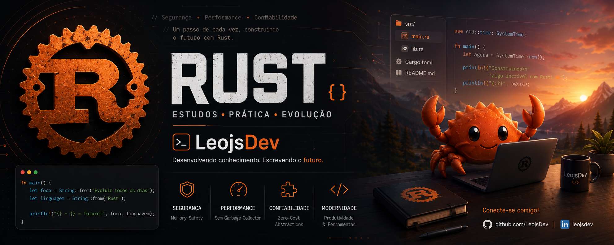

<div align="center">
  
</div>

<br>
<div align="center">

# 🦀 Rust Studies


### Minha jornada de aprendizado na linguagem Rust

[]
[]
[]

</div>

---

## 📖 Sobre o Projeto

Este repositório foi criado para documentar minha evolução no aprendizado da linguagem **Rust**.

Aqui você encontrará:

- 📚 Exercícios
- 🧠 Desafios de lógica
- ⚙️ Estudos de sintaxe
- 🦀 Conceitos fundamentais do Rust
- 🚀 Pequenos projetos práticos
- 📝 Anotações e exemplos

O objetivo é construir uma base sólida em Rust enquanto aplico boas práticas de desenvolvimento e versionamento com Git e GitHub.

---

## 🎯 Objetivos de Aprendizado

- [ ] Entender Ownership e Borrowing
- [ ] Trabalhar com Structs e Enums
- [ ] Manipular Collections
- [ ] Utilizar Pattern Matching
- [ ] Criar módulos e pacotes
- [ ] Trabalhar com Traits
- [ ] Tratamento de erros
- [ ] Concorrência (Threads)
- [ ] Consumo de APIs
- [ ] Desenvolvimento Web com Rust
- [ ] Criar projetos completos

---

## 🛠️ Tecnologias

- 🦀 Rust
- 📦 Cargo
- 🌐 Git
- 💻 VS Code

---

## 📂 Estrutura do Repositório

```bash
rust/
│
├── estudos/
├── exercicios/
├── desafios/
├── projetos/
└── README.md